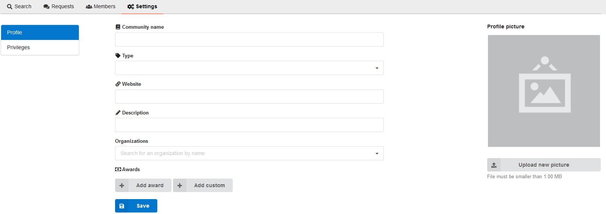
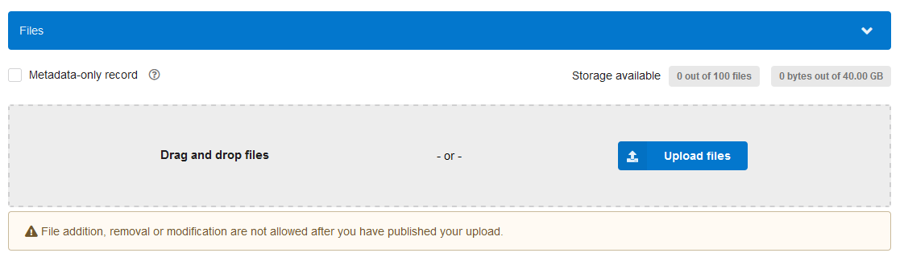
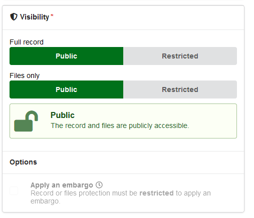
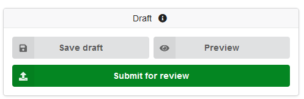
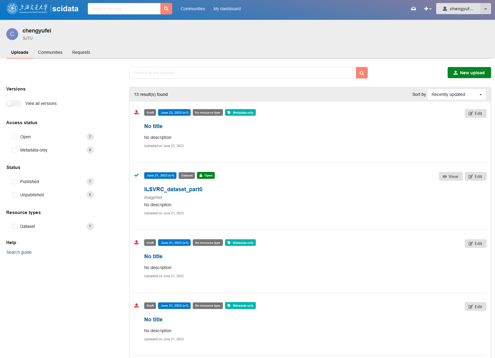
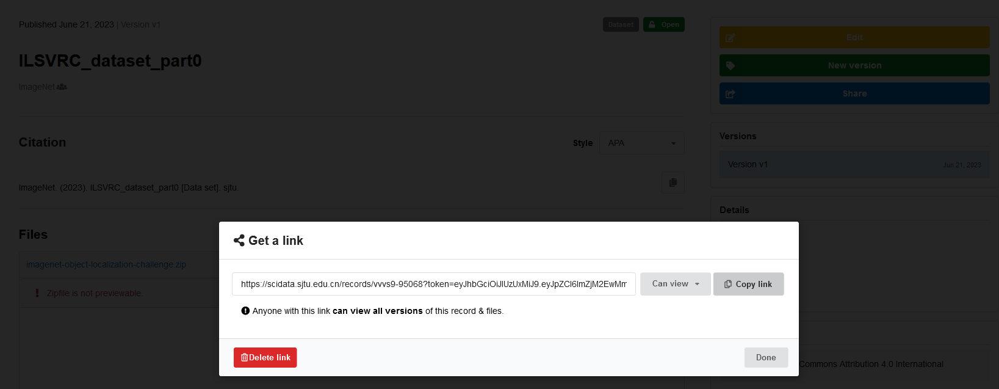
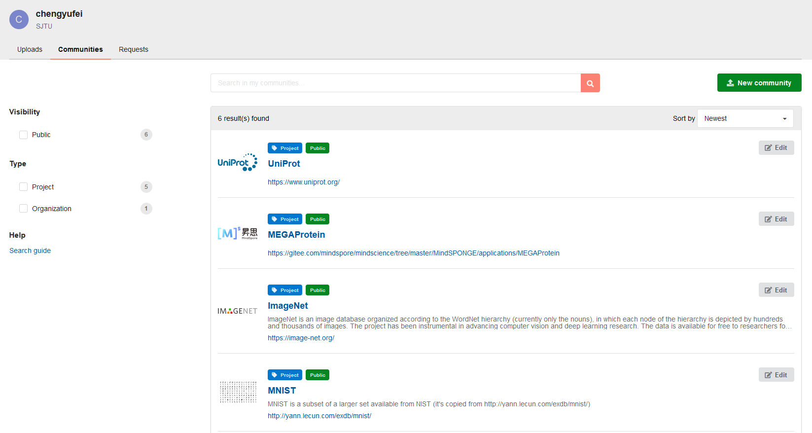
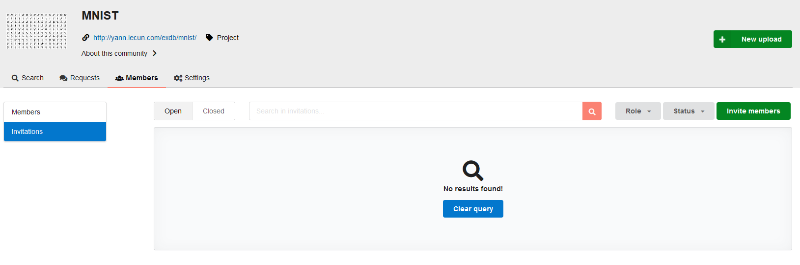

# 数据管理员/合作者

## 1. 建立项目空间

step 1. [登录账户](https://scidata.sjtu.edu.cn/login/?next=%2F)，点击New community创建一个新的项目空间，设置项目权限。

step 2. 在setting中填写项目基本信息，点击save保存。

step 3. 点击New upload进入数据上传页面。

## 2. 上传数据

step 1. 拖拽文件或点击Upload files上传数据，单次上传记录中文件大小不得超过40GB。

红色进度条表示上传失败，需要重新上传数据。

step 2. 填写数据记录信息，包括基础信息、补充信息和项目资金支持等内容。

step 3. 修改数据记录权限。

step 4. 点击Submit for review提交上传请求。

step 5. 点击Accept and publish发布数据。

step 6. 在My dashboard中查看发布的数据。

## 3. 共享数据

数据所有者共享数据共有两种方式：创建共享链接与邀请团队成员。

### 创建分享链接

step 1. 在My dashboard中查找需要共享的数据。

step 2. 在数据记录页面点击share创建链接，设置分享权限。

step 3. 向他人分享链接。

### 邀请团队成员

step 1. 点击对应community的edit进入编辑页面。

step 2. 在Members中选择Invitations，点击Invite members邀请数据平台用户进入项目空间。

# 普通用户

## 1. 下载数据集
step 1. 在[科学数据平台首页](https://scidata.sjtu.edu.cn/)搜索框中输入公开数据集的名称。

step 2. 在搜索结果中选择符合需求的数据记录。

step 3. 进入数据记录界面点击download下载对应的公开数据集
